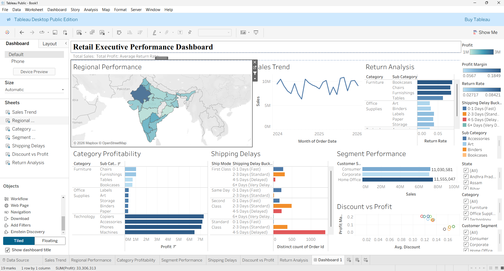
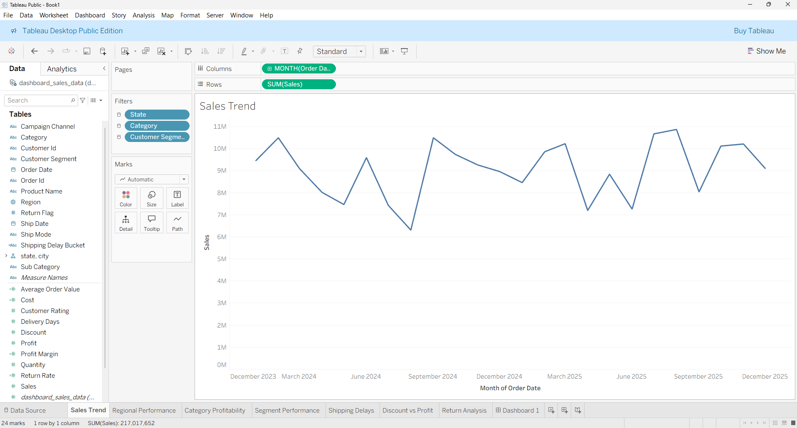
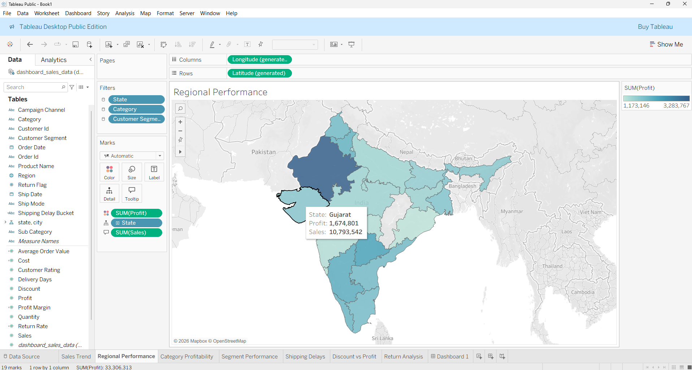
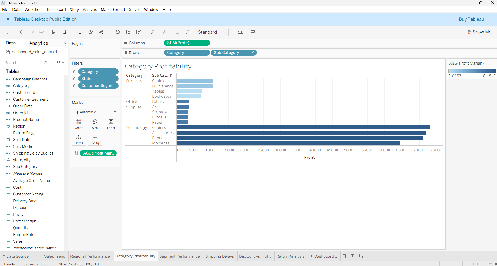
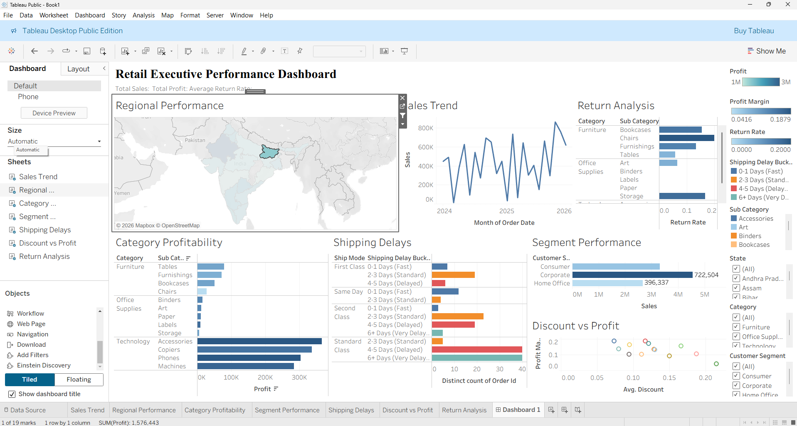

# 📈 Retail Executive Performance & Strategic Insights Dashboard

## 1. Executive Summary & Business Problem Statement
### The Challenge
The retail leadership team currently lacks a centralized, interactive mechanism to monitor macroscopic organizational health and microscopic segment performance. Without clear visibility into exactly which regions, product categories, and customer segments are driving profit—and which are bleeding revenue—leadership cannot make agile, data-driven decisions. Relying on static, siloed reports has led to blind spots regarding supply chain efficiency, return rates, and the true impact of discounting strategies.

### The Objective
The objective of this capstone project is to engineer a highly interactive Tableau dashboard (`executive_dashboard.twbx`) that transforms raw transactional data into actionable business intelligence. This tool is designed specifically for executive leadership, moving beyond basic descriptive statistics to provide diagnostic insights. It is built to quickly answer critical questions:
*   *Where are our most profitable markets?*
*   *Which products are risking our bottom line through high return rates or aggressive discounting?*
*   *Is our shipping infrastructure meeting customer expectations?*

---

## 2. Dataset Architecture & Description
The foundational data for this analysis is derived from `dashboard_sales_data.csv`, representing thousands of transactional retail records across the Indian market. The dataset provides a multidimensional view of the business, encompassing geographic, categorical, financial, and operational vectors.

### Comprehensive Data Dictionary
| Field Name | Data Type | Tableau Role | Description & Business Context |
| :--- | :--- | :--- | :--- |
| `order_id` | String | Dimension | Unique identifier for every transaction. Used for distinct counts (e.g., AOV). |
| `order_date` | Date | Dimension | The date the transaction was placed. Critical for time-series and trend analysis. |
| `ship_date` | Date | Dimension | The date the product left the facility. |
| `customer_id` | String | Dimension | Unique identifier for the purchasing entity. |
| `customer_segment` | String | Dimension | Market classification (e.g., Consumer, Corporate, Home Office). |
| `region` | String | Dimension | Broad geographic grouping. |
| `state` | Geographic | Dimension | State-level geographic data used for spatial mapping. |
| `city` | Geographic | Dimension | City-level geographic data for granular spatial analysis. |
| `category` | String | Dimension | Macro-level product classification (e.g., Technology, Furniture). |
| `sub_category` | String | Dimension | Micro-level product classification (e.g., Copiers, Binders). |
| `product_name` | String | Dimension | The specific SKU/item name. |
| `ship_mode` | String | Dimension | The chosen shipping tier (e.g., First Class, Standard Class). |
| `sales` | Float | Measure | Total revenue generated from the line item (in local currency). |
| `quantity` | Integer | Measure | Total units purchased in the line item. |
| `discount` | Float | Measure | The percentage discount applied to the transaction (decimal format). |
| `profit` | Float | Measure | Gross profit generated after cost of goods sold. |
| `return_flag` | Binary/Int | Dimension | Indicates if the item was returned (1 = Yes, 0 = No). *Converted from Measure.* |
| `delivery_days` | Integer | Measure | Time delta between order date and ship date. |
| `customer_rating` | Integer | Measure | Post-purchase satisfaction score (1-5 scale). |
| `campaign_channel` | String | Dimension | Marketing channel attribution. |

---

## 3. Calculated Fields Engineering
To extract deeper analytical value, base metrics were transformed into five strategic KPIs via Tableau's calculation engine. 

1. **Profit Margin**
   * **Formula:** `SUM([profit]) / SUM([sales])` (Formatted as %)
   * **Strategic Purpose:** Revenue alone is a vanity metric. Profit margin isolates the actual financial efficiency of our sales, allowing us to compare the profitability of a $100 sale versus a $10,000 sale on equal footing.
2. **Cost of Goods (Cost)**
   * **Formula:** `[sales] - [profit]`
   * **Strategic Purpose:** Isolates the raw expense side of the ledger, allowing leadership to track supply chain and manufacturing costs over time.
3. **Average Order Value (AOV)**
   * **Formula:** `SUM([sales]) / COUNTD([order_id])`
   * **Strategic Purpose:** Tracks consumer purchasing power and basket size. A vital metric for marketing teams to determine if upselling and cross-selling campaigns are effective.
4. **Return Rate**
   * **Formula:** `COUNTD(IF [return_flag] = 1 THEN [order_id] END) / COUNTD([order_id])` (Formatted as %)
   * **Strategic Purpose:** Acts as a proxy for product quality and customer satisfaction. High return rates directly erode profit margins due to reverse logistics costs.
5. **Shipping Delay Bucket**
   * **Formula:** 
     ```tableau
     IF [delivery_days] <= 1 THEN "0-1 Days (Fast)"
     ELSEIF [delivery_days] <= 3 THEN "2-3 Days (Standard)"
     ELSEIF [delivery_days] <= 5 THEN "4-5 Days (Delayed)"
     ELSE "6+ Days (Very Delayed)"
     END
     ```
   * **Strategic Purpose:** Averages hide outliers. Grouping delivery days into qualitative buckets allows logistics teams to instantly see the volume of orders failing to meet acceptable delivery SLAs (Service Level Agreements).

---

## 4. Dashboard Components & Visual Analytics
The executive dashboard was constructed using visualization best practices, ensuring cognitive load is minimized while insights are maximized.

*   **Executive KPI Banner:** Positioned at the top (F-pattern reading) to immediately anchor the user with macro metrics: Total Sales, Total Profit, and Overall Return Rate.
*   **Sales Trend (Line Chart):** Answers "How is revenue trending?" Line charts are the optimal choice for continuous time-series data, stripping away visual noise to expose seasonality.
*   **Regional Profitability (Filled Spatial Map):** Answers "Where are we succeeding geographically?" A map leverages human spatial recognition. A sequential color palette (e.g., light to dark) immediately highlights dominant hubs (Rajasthan) vs. struggling territories (Odisha).
*   **Category Profitability (Sorted Horizontal Bar Chart):** Answers "What products drive our business?" Sorted descending to create a clear hierarchy. Horizontal bars allow for clean reading of text labels without neck strain.
*   **Customer Segment (Bar Chart with Labels):** Answers "Who is buying?" Compares the volume and profit contributions of B2B vs. B2C consumers.
*   **Shipping Delays (Stacked Bar by Ship Mode):** Answers "Are our logistics efficient?" Utilizes the `Shipping Delay Bucket` on the color mark to visually expose standard class bottlenecks.
*   **Return Analysis (Highlight Table):** Answers "Where are our quality control failures?" Uses color intensity to draw the eye directly to the problem areas (Furniture).
*   **Discount vs Profit (Scatter Plot):** Answers "Is discounting working?" Plots individual sub-categories on a dual axis to prove or disprove the correlation between aggressive price cuts and profit retention.

---

## 5. Dashboard User Guide (Interactivity & Flow)
The dashboard is fully dynamic, shifting from a macro-company view to micro-level diagnostics via interactive filters and actions.

*   **Global Filters:** Located on the right-hand side, users can filter the entire dataset by `Region`, `Category`, or `Customer Segment`. Changing these dropdowns recalculates all KPIs and charts simultaneously.
*   **Spatial Filtering (Dashboard Action):** The Regional Performance Map functions as the primary interactive engine. By clicking on any specific State (e.g., clicking on Telangana), the map acts as a filter. All supporting charts—trends, segments, and categories—instantly update to reflect the performance *only within that selected state*. 

---

## 6. Deep-Dive Business Insights
Data exploration yielded eight critical insights requiring leadership attention:

1.  **Macro Financial Health:** The business is strong at a high level. Total sales amount to $217,017,651 with a total profit of $33,306,312. This yields a very healthy organizational profit margin of 15.3%.
2.  **Geographical Disparity:** Profit is highly concentrated. Rajasthan ($3.28M profit), Telangana, and Karnataka are massive success stories. Conversely, Odisha, Goa, and Maharashtra are underperforming (all under $1.3M profit) despite having addressable markets.
3.  **The Technology Engine:** The Technology category is the undisputed financial pillar of the company, generating roughly 84% of total profit ($28.04M). Copiers and Accessories alone account for $14.4M in profit. 
4.  **The Office Supplies Drag:** Despite high volume, traditional Office Supplies are low-margin anchors. Binders and Paper are the lowest-performing sub-categories, barely breaking $320K in profit each.
5.  **Logistical Bottlenecks:** Our standard shipping infrastructure is slow. While "Same Day" (0.4 days) and "First Class" (1.7 days) meet expectations, "Standard Class" averages 4.7 days, pushing dangerously close to a full business week.
6.  **The Furniture Return Crisis:** The overall company return rate is 4.5%. However, the Furniture category has a return rate of 7.6%—more than double the rate of Technology (3.0%). 
7.  **Destructive Discounting:** The scatter plot analysis reveals that aggressive discounting (above 15-20%) does not create enough volume to offset the margin loss, resulting in negative profitability on highly discounted items.
8.  **Vulnerability to Disruption (Risk):** Because nearly half of the company's profit is tied to just two sub-categories (Copiers and Accessories), any supply chain disruption or competitor innovation in those specific sectors poses an existential threat to the company's quarterly earnings.

---

## 7. The Data Narrative (Dashboard Story)
Our retail operations are currently highly profitable, but that profitability is masking significant structural imbalances. We are effectively operating two very different businesses: a highly lucrative technology and western/southern-state operation, and a struggling, low-margin office supply and eastern-state operation. 

Our success is fragile due to extreme product concentration—if the Copier market shifts, our margins will collapse. Furthermore, we are bleeding operational capital in two hidden areas: reversing logistics for a massive volume of returned Furniture, and giving away margin through unchecked discounting strategies. 

**Strategic Recommendations:**
*   **Cap Discounts:** Implement a hard system cap of 15% on non-clearance discounting to protect gross margins.
*   **Investigate Furniture Quality:** Trigger an immediate supply-chain audit of the Furniture sub-category to determine if the 7.6% return rate is due to shipping damage, poor manufacturing, or inaccurate website descriptions.
*   **Logistics Renegotiation:** Challenge our logistics carriers to reduce Standard Class delivery times from 4.7 days to under 3.5 days to prevent customer churn.

---

## 8. Assumptions and Technical Limitations
*   **Data Completeness:** It is assumed there are no missing chronological gaps in the `order_date` field that would skew seasonality analysis.
*   **Return Flag Handling:** The `return_flag` was natively read as a continuous measure by Tableau. It was manually converted to a binary dimension (0 = Kept, 1 = Returned) for accurate aggregation.
*   **Financial Scope:** Profit calculations in this dashboard represent *Gross Profit* (Sales minus Cost of Goods Sold). It does not factor in operational overhead, such as warehouse leasing, employee salaries, or Customer Acquisition Cost (CAC) marketing spend.
*   **Geographic Scope:** The geographic dataset is assumed to represent the Indian market, and all financial metrics are assumed to be recorded in Indian Rupees (INR) without need for real-time currency conversion.

---

## 9. Included Deliverables & Screenshots
The final submission repository includes the following assets:
*   `dashboard_sales_data.csv` (Base Dataset)
*   `executive_dashboard.twbx` (Packaged Tableau Workbook)
*   `outputs/business_insights.md` (Insight breakdown)
*   `outputs/dashboard_story.md` (Leadership narrative)
*   `outputs/chart_selection_justification.md` (Design philosophy)
*
## 10. Screenshots Folder (`/screenshots`):**
 (Complete UI)
 (Time-series specific)
 (Spatial specific)
 (Hierarchical specific)
 (Proof of dynamic action logic)
